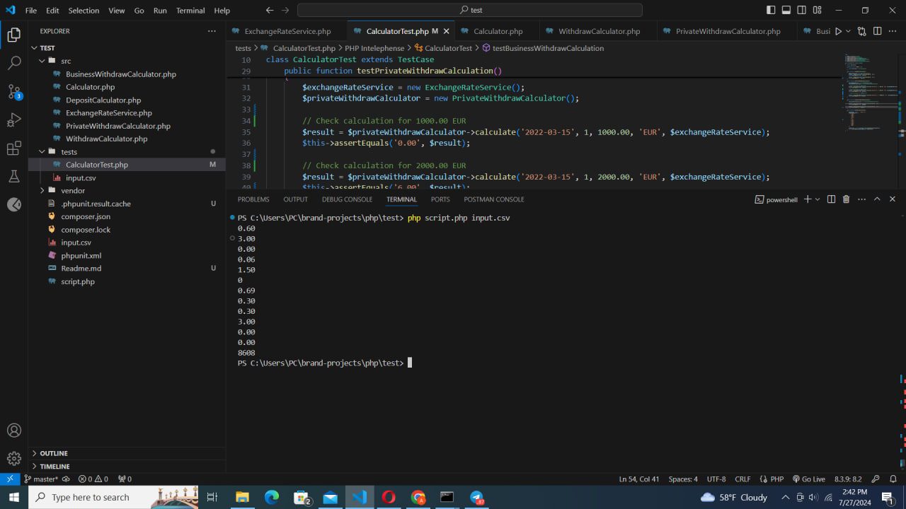
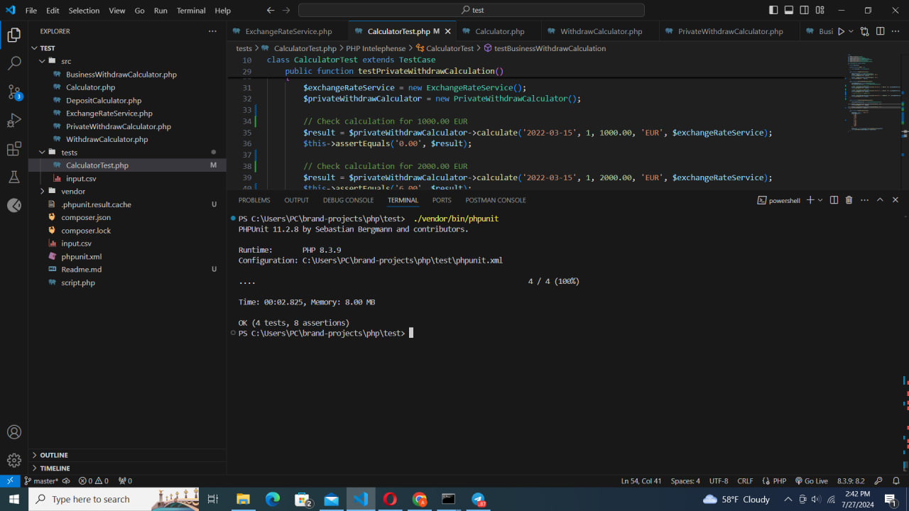

---

# Commission Calculator

This project is a Commission Calculator implemented in PHP. It calculates the commission fees for different types of transactions including deposits, private withdrawals, and business withdrawals. The project is tested using PHPUnit.

## Table of Contents
- [Setup](#setup)
- [Running the Application](#running-the-application)
- [Running Tests](#running-tests)
- [Project Structure](#project-structure)
- [Screenshots](#screenshots)
- [Contributing](#contributing)
- [License](#license)

## Setup

### Prerequisites
- PHP 8.3 or higher
- Composer

### Installation

1. **Clone the Repository**

   ```sh
   git clone https://github.com/yourusername/commission-calculator.git
   cd commission-calculator
   ```

2. **Install Dependencies**

   ```sh
   composer install
   ```

## Running the Application

To run the application and calculate commissions from an input file:

1. **Place your input file** (e.g., `input.csv`) in the project directory.

2. **Run the script**

   ```sh
   php script.php input.csv
   ```

This will output the calculated commissions for each transaction in the input file.

## Running Tests

To run the tests using PHPUnit:

1. **Ensure dependencies are installed**

   ```sh
   composer install
   ```

2. **Run PHPUnit**

   ```sh
   ./vendor/bin/phpunit
   ```

This will execute the test suite and display the results.

## Project Structure

```
commission-calculator/
├── src/
│   ├── Calculator.php
│   ├── ExchangeRateService.php
│   ├── PrivateWithdrawCalculator.php
│   ├── DepositCalculator.php
│   └── BusinessWithdrawCalculator.php
├── tests/
│   └── CalculatorTest.php
├── input.csv
├── composer.json
├── script.php
└── phpunit.xml
```

- **src/**: Contains the main source code for the Commission Calculator.
- **tests/**: Contains the PHPUnit test cases.
- **input.csv**: Example input file for commission calculations.
- **composer.json**: Composer configuration file.
- **script.php**: Script to run the commission calculations.
- **phpunit.xml**: PHPUnit configuration file.

## Screenshots

### Result of Running the Application



This screenshot shows the output of running the `script.php` file with `input.csv`. Each line represents the calculated commission for a transaction.

### Result of Running the Tests



This screenshot shows the output of running the PHPUnit test suite. The test results indicate whether the application's calculations are correct based on the provided test cases.

## Contributing

Contributions are welcome! Please fork the repository and submit a pull request with your changes.

## License

This project is licensed under the MIT License.

---

